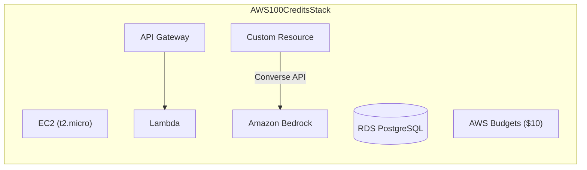

# AWS Credits Collector - CDK Python 🚀

[](https://www.python.org/)
[](https://aws.amazon.com/cdk/)
[](LICENSE)

Automates the creation of all 5 AWS infrastructure components required to complete the "Earn AWS Credits" dashboard milestones and claim up to $100 USD in AWS promotional credits using AWS CDK in Python.

## 📐 Architecture Diagram


## 📁 Project Structure
```bash
aws-credits-collector-cdk-python/
├── app.py                     # CDK Application entry point
├── cdk.json                   # CDK configuration file
├── requirements.txt           # Python dependencies (aws-cdk-lib, etc.)
└── stacks/
    ├── __init__.py
    ├── credits_stack.py       # Main stack orchestrator
    ├── constructs/            # Modular CDK constructs (IaC)
    │   ├── __init__.py
    │   ├── bedrock_construct.py  # Amazon Bedrock Custom Resource
    │   ├── budget_construct.py   # AWS Budgets setup
    │   ├── compute_construct.py  # EC2 instance definition
    │   ├── database_construct.py # RDS PostgreSQL instance
    │   └── web_app_construct.py  # Lambda + API Gateway setup
    └── src/                   # Lambda function source code
        └── web_app.py         # HTTP API Handler (Hello World)
```

## 📋 Prerequisites

Before deploying the stack, ensure you have the following installed and configured on your environment:

* **Python 3.9+**
* **Node.js** & **AWS CDK CLI**: Installed globally (`npm install -g aws-cdk`)
* **AWS CLI v2**: Installed and authenticated (`aws configure`)

## 🚀 Quickstart & Deployment

Run these steps in your terminal to deploy the stack to your AWS account:
```bash
# 1. Clone & enter project
git clone https://github.com/YOUR_USER/aws-credits-collector-cdk-python.git
cd aws-credits-collector-cdk-python

# 2. Setup virtual environment & dependencies
python3 -m venv .venv
source .venv/bin/activate  # Windows: .venv\Scripts\Activate.ps1
pip install -r requirements.txt

# 3. Validate & Deploy to AWS
cdk bootstrap  # Required once per account/region
cdk synth      # Synthesize CloudFormation template
cdk deploy
```

## 🧹 Cleanup

To avoid incurring any unwanted charges, you can destroy all deployed resources with a single command:
```bash
cdk destroy
```

## ⚠️ Important Notes

**_Bedrock Milestone Notice_**: The AWS Console currently does not automatically recognize programmatically triggered Bedrock API calls via Custom Resources for the milestone credit. The CDK code is retained for architectural and learning purposes.

To claim the $20 Bedrock credit manually:
AWS Console ➔ Amazon Bedrock ➔ Playgrounds ➔ Select any model ➔ Run a prompt ➔ Done!

## 👤 Author
Created by **Thiago Ericson Cabral**
* 💼 LinkedIn: [in/thiagoericson](https://www.linkedin.com/in/thiagoericson/)
* ✍️ Medium (pt-BR): [@thiagoericson](https://medium.com/@thiagoericson)
* ☁️ AWS Builder Center (en-US): [@thiagocabral](https://builder.aws.com/community/@thiagocabral)
